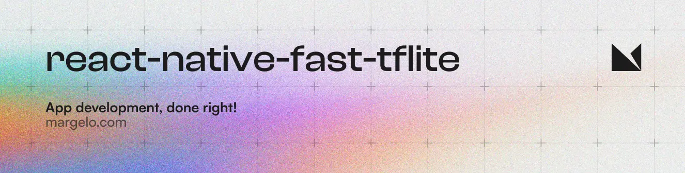

<a href="https://margelo.io">
  <picture>
    <source media="(prefers-color-scheme: dark)" srcset="./img/banner-dark.webp" />
    <source media="(prefers-color-scheme: light)" srcset="./img/banner-light.webp" />
    
  </picture>
</a>

A high-performance [TensorFlow Lite](https://www.tensorflow.org/lite) library for React Native, built with [Nitro Modules](https://github.com/mrousavy/nitro).

- ⚡ Powered by Nitro Modules
- 💨 Zero-copy ArrayBuffers
- 🔧 Uses the low-level C/C++ TensorFlow Lite core API for direct memory access
- 🔄 Supports swapping out TensorFlow Models at runtime
- 🖥️ Supports GPU-accelerated delegates (CoreML/Metal/OpenGL)
- 📸 Easy [VisionCamera](https://github.com/mrousavy/react-native-vision-camera) integration

## Migrating from v2

If you are upgrading from v2, see the [Migration Guide](./MIGRATION_V2_TO_V3.md) for breaking changes and upgrade steps.

## Installation

1. Add the npm packages:
   ```sh
   yarn add react-native-fast-tflite react-native-nitro-modules
   ```
2. In `metro.config.js`, add `tflite` as a supported asset extension:
   ```js
   module.exports = {
     // ...
     resolver: {
       assetExts: ['tflite', // ...
       // ...
   ```
   This allows you to drop `.tflite` files into your app and swap them out at runtime without rebuilding. 🔥
3. (Optional) To enable GPU delegates, see [Using GPU Delegates](#using-gpu-delegates) below.
4. Run your app (`yarn android` / `npx pod-install && yarn ios`)

## Usage

1. Find a TensorFlow Lite (`.tflite`) model. There are thousands of public models on [tfhub.dev](https://tfhub.dev).
2. Drag your model into your app's asset folder (e.g. `src/assets/my-model.tflite`)
3. Load the Model:

   ```ts
   // Option A: Standalone Function
   const model = await loadTensorflowModel(require('assets/my-model.tflite'))

   // Option B: Hook in a Function Component
   const plugin = useTensorflowModel(require('assets/my-model.tflite'))
   ```

4. Call the Model:
   ```ts
   const inputData: ArrayBuffer = ...
   const outputData = await model.run([inputData])
   console.log(outputData)
   ```

### Loading Models

Models can be loaded from the React Native bundle via `require(..)`, or any URI/URL (`http://..` or `file://..`):

```ts
// Asset from React Native Bundle
loadTensorflowModel(require('assets/my-model.tflite'))
// File on the local filesystem
loadTensorflowModel({ url: 'file:///var/mobile/.../my-model.tflite' })
// Remote URL
loadTensorflowModel({
  url: 'https://tfhub.dev/google/lite-model/object_detection_v1.tflite',
})
```

Loading a Model is asynchronous since buffers need to be allocated. Make sure to handle errors when loading.

### Input and Output data

TensorFlow uses _tensors_ as input and output. Since TensorFlow Lite is optimized for fixed-size byte buffers, you are responsible for interpreting the raw data yourself.

Input and output values are passed as `ArrayBuffer`. To inspect tensor shapes, open your model in [Netron](https://netron.app).

For example, the `object_detection_mobile_object_localizer_v1_1_default_1.tflite` model on [tfhub.dev](https://tfhub.dev) has **1 input tensor** and **4 output tensors**:


In the description on [tfhub.dev](https://tfhub.dev) we can find the description of all tensors:


From that we know we need a 192 x 192 input image with 3 bytes per pixel (RGB).

#### Usage (VisionCamera)

> [!NOTE]
> The example below targets **VisionCamera v4**. A VisionCamera v5 integration exists but is currently part of a private project — [sponsor Marc Rousavy](https://github.com/sponsors/mrousavy) to get access.

If you're using this model with a [VisionCamera](https://github.com/mrousavy/react-native-vision-camera) Frame Processor, you need to convert the Frame to the model's expected input size.
Use [vision-camera-resize-plugin](https://github.com/mrousavy/vision-camera-resize-plugin) to do the conversion:

```tsx
import { NitroModules } from 'react-native-nitro-modules'

const objectDetection = useTensorflowModel(require('object_detection.tflite'))
const model =
  objectDetection.state === 'loaded' ? objectDetection.model : undefined

// TfliteModel is a Nitro HybridObject (jsi::NativeState). VisionCamera v4's worklet
// runtime cannot access jsi::NativeState directly — box it into a jsi::HostObject
// before capture, then unbox() inside the worklet to run inference.
// This will not be necessary in VisionCamera v5, which is itself a Nitro Module
// and can access HybridObjects directly.
const boxedModel = useMemo(
  () => (model != null ? NitroModules.box(model) : undefined),
  [model]
)

const { resize } = useResizePlugin()

const frameProcessor = useFrameProcessor(
  (frame) => {
    'worklet'
    if (boxedModel == null) return

    const tflite = boxedModel.unbox()

    // 1. Resize 4k Frame to 192x192x3 using vision-camera-resize-plugin
    const resized = resize(frame, {
      scale: {
        width: 192,
        height: 192,
      },
      pixelFormat: 'rgb',
      dataType: 'uint8',
    })

    // 2. Extract the exact slice of the underlying ArrayBuffer
    //    (TypedArrays may have a non-zero byteOffset into a shared buffer)
    const inputBuffer = resized.buffer.slice(
      resized.byteOffset,
      resized.byteOffset + resized.byteLength
    )

    // 3. Run model with given input buffer synchronously
    const outputs = tflite.runSync([inputBuffer])

    // 4. Interpret outputs accordingly
    const detection_boxes = new Float32Array(outputs[0]!)
    const detection_classes = new Float32Array(outputs[1]!)
    const detection_scores = new Float32Array(outputs[2]!)
    const num_detections = new Float32Array(outputs[3]!)
    console.log(`Detected ${num_detections[0]} objects!`)
  },
  [boxedModel]
)

return <Camera frameProcessor={frameProcessor} {...otherProps} />
```

### Using GPU Delegates

GPU Delegates offer faster, GPU-accelerated computation. There are multiple delegates available:

#### CoreML (iOS)

##### Expo

Use the config plugin in your expo config (`app.json`, `app.config.json` or `app.config.js`):

```json
{
  "name": "my app",
  "plugins": [
    [
      "react-native-fast-tflite",
      {
        "enableCoreMLDelegate": true
      }
    ]
  ]
}
```

##### Bare React Native

1. Set `$EnableCoreMLDelegate` to `true` in your `Podfile`:

   ```ruby
   $EnableCoreMLDelegate=true

   # rest of your podfile...
   ```

2. Open your iOS project in Xcode and add the `CoreML` framework under **General → Frameworks, Libraries and Embedded Content**.
3. Re-install Pods and build:
   ```sh
   cd ios && pod install && cd ..
   yarn ios
   ```
4. Use the CoreML Delegate:
   ```ts
   const model = await loadTensorflowModel(
     require('assets/my-model.tflite'),
     ['core-ml']
   )
   ```

> [!NOTE]
> Not all model operations are supported on the CoreML delegate. Make sure your model is compatible.

#### Android GPU/NNAPI (Android)

To enable GPU or NNAPI on Android, you **may** need to include native libraries, especially on Android 12+.

##### Expo

Use the config plugin in your expo config (`app.json`, `app.config.json` or `app.config.js`) with `enableAndroidGpuLibraries`:

```json
{
  "name": "my app",
  "plugins": [
    [
      "react-native-fast-tflite",
      {
        "enableAndroidGpuLibraries": true
      }
    ]
  ]
}
```

By default, when enabled, `libOpenCL.so` will be included in your `AndroidManifest.xml`. You can also include more libraries by passing an array:

```json
{
  "name": "my app",
  "plugins": [
    [
      "react-native-fast-tflite",
      {
        "enableAndroidGpuLibraries": ["libOpenCL-pixel.so", "libGLES_mali.so"]
      }
    ]
  ]
}
```

> [!NOTE]
> For Expo, remember to run prebuild if the library is not yet included in your `AndroidManifest.xml`.

##### Bare React Native

Add any needed entries to your `AndroidManifest.xml`:

```xml
<uses-native-library android:name="libOpenCL.so" android:required="false" />
<uses-native-library android:name="libOpenCL-pixel.so" android:required="false" />
<uses-native-library android:name="libGLES_mali.so" android:required="false" />
<uses-native-library android:name="libPVROCL.so" android:required="false" />
```

Then use the delegate:

```ts
const model = await loadTensorflowModel(
  require('assets/my-model.tflite'),
  ['android-gpu']
)
// or
const model = await loadTensorflowModel(
  require('assets/my-model.tflite'),
  ['nnapi']
)
```

> [!WARNING]
> NNAPI is deprecated on Android 15. GPU delegate is preferred.

> [!NOTE]
> Android does not officially support OpenCL, but most GPU vendors do.

## Community Discord

[Join the Margelo Community Discord](https://discord.gg/6CSHz2qAvA) to chat about react-native-fast-tflite or other Margelo libraries.

## Adopting at scale

<a href="https://github.com/sponsors/mrousavy">
  
</a>

This library is provided _as is_, I work on it in my free time.

If you're integrating react-native-fast-tflite in a production app, consider [funding this project](https://github.com/sponsors/mrousavy) and <a href="mailto:me@mrousavy.com?subject=Adopting react-native-fast-tflite at scale">contact me</a> to receive premium enterprise support, help with issues, prioritize bugfixes, request features, and more.

## Contributing

1. Clone the repo
2. Make sure you have installed Xcode CLI tools such as `gcc`, `cmake` and `python`/`python3`. See the TensorFlow documentation on what you need exactly.
3. Run `yarn bootstrap` and select `y` on all iOS and Android related questions.
4. Open the example app and start developing
   - iOS: `example/ios/TfliteExample.xcworkspace`
   - Android: `example/android`

See the [contributing guide](CONTRIBUTING.md) to learn how to contribute to the repository and the development workflow.

## License

MIT
